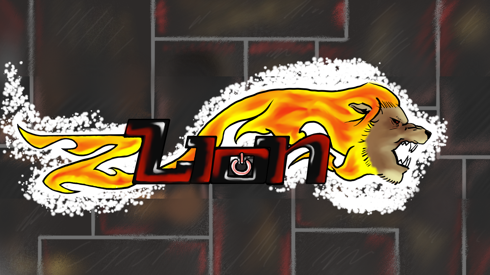

# geymsla-1
prufugeymsla fyrir skólan



1. [tilvísun](#tilvísun)
1. [listar](#listar)
    1. [óraðað](#óraðaður-listi)
    1. [raðaður](#raðaður-listi)
1. [tafla](#tafla)
1. [likar og kóði](#linkar-kóði)
1. [allskonar texti](#allskonar-texti)

annar texi


## tilvísun

> hér hemur tilvísun í einghvern merkan texta

## listar

### óraðaður listi

- item 1
- item 2
- item 3   
    - subitem 1
        - subsubitem
- item 4

### raðaður listi
1. item 1
1. item 2
    1. subitem 1
    1. subitem 2
    1. subitem 3
    1. subitem 4
    1. subitem 5
    1. subitem 6

## tafla
 haus 1 | haus 2 | haus 3 
 --- | --- | ---
 12 | 32 | 89
 213| 31 | 217

## linkar, kóði

 [hér](https://www.tskoli.is) er heimasíða tækniskólans.


<!-- hér fyrir neðan er kóður úr arduino -->
```arduino
void setup() {
    Serial.begin(9600);
    Serial.printlin("halló");
}
```

## allskonar texti

**texti, *annar* \*texti**

*skáletrað* 

~~gegnumstrikað~~
